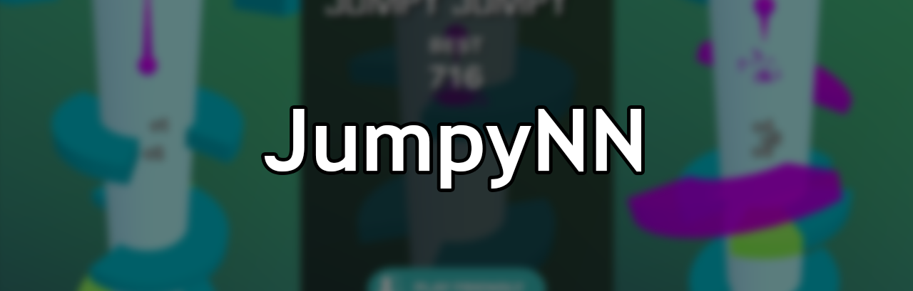
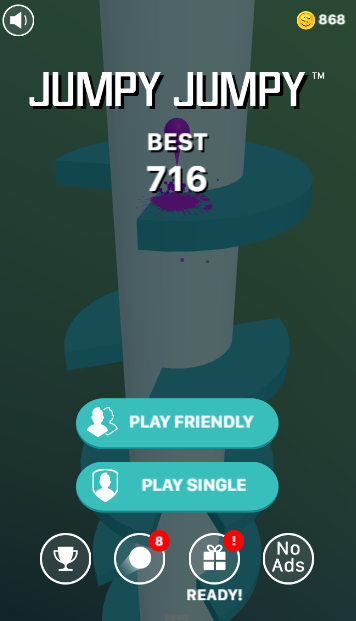
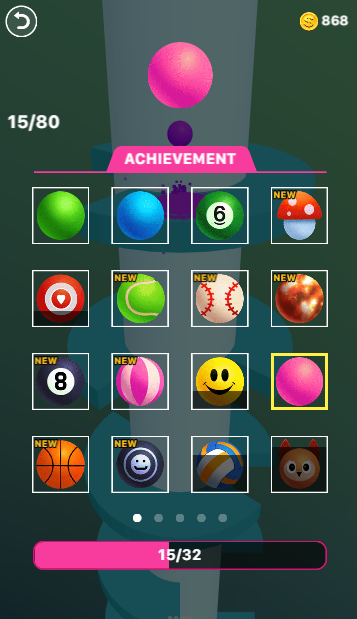

# JumpyNN

 

This project is a trial to train a neural network to play [Facebook's Jumpy Jumpy Game](https://www.facebook.com/instantgames/198982457542294)

 

# Code

The full source code is available under GPL-3.0 License in my Github repository [ghaiszaher/JumpyNN](https://github.com/ghaiszaher/JumpyNN)

## Dependencies

Make sure that the following are installed:
* Python3
* Keras
* Tensorflow
* Opencv2 & Numpy
* Pillow
* pynput
* mss
* Jupyter Notebook

## Adjust Configuration Files
For this version, auto-calibration was not made. You need to open [Facebook's Jumpy Jumpy Game](https://www.facebook.com/instantgames/198982457542294) and go to the file "jumpy_settings" to adjust the following:
* monitor.left & monitor.top: the location of the game's div relative to the screen
* monitor.width & monitor.height: the size of the game's div

## Adjust Template Files
Template files are responsible for determining wether the current screen is Main Menu, Scoreboard or Continue Playing. They are located in _templates_ folder:

  &nbsp;
  &nbsp;
  &nbsp;

You need to replace these 3 images with images taken from your screen inside the gameplay.

## Adjust Ball Color
From inside the game, make sure to adjust the ball color to the Pink one, otherwise you will need to change the colors settings.

 

## Capture Data
Run the file "record.py" and play the game to collect images & outputs for your gameplay.
A new folder will be created "gameplay_logs" that contains images + mouse dragging movement info during the gameplay.

## Train
* Extract features from images and generate Training Data: Run the jupyter notebook 's file generate_X_y. This will generate several files called "features_X_y.npz", the final one will be in "gameplay_logs/features_X_y.npz", and will contain the training data from all the images combined.
* Run the jupyter notebook's file "train.ipynb" to create and run the neural network. Final Neural Network files (config & weights) will be stored in "gameplay_logs"

## Test Trained Data
Run the file "run.py" to test

## Results
Trained network's gameplay:

 

## Note
If you're trying to run this on Windows, you might have some issues with mouse drag using pyautogui library. I tested it on Ubuntu 18.04.2 LTS.

&copy; Ghais Zaher 2020

